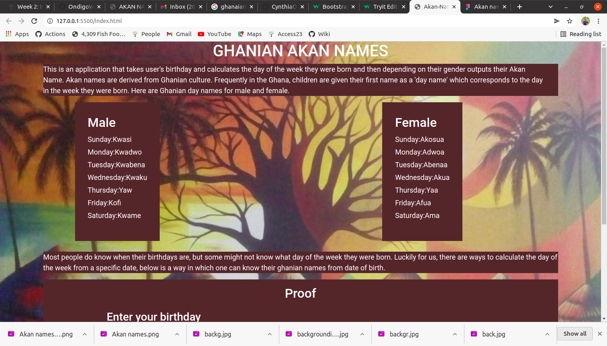

## GHANIAN AKAN NAMES

## Name of the Aurthor
Cynthia Ouma Awuor

## structure

## Description
This is a website that shows the ghanian Akan names. It allows users to enter their birthdays the outputs their Akan names that corresponds to their day of birth.

## Installation Requirements
1.computer 
2 An access to the Internet

## Installation Process
Figma: click here to view the design: https://www.figma.com/file/smnz800vKwt6pxJtSxPunt/Akan-names?node-id=0%3A1
Click on the link provided bellow to view the site. https://github.com/CynthiaOuma12673/ghanian-names

## Technology Used
HTML- which was used to build the structure of the pages.

CSS - which was used to style the pages incuding the left aside navigation bar.

Bootstrap- which as also used for styling.

Javascript-For interractivity.

## Reference
Materialize CSS

## Licence MIT License
Copyright (c) [2021] [Akan Names]

Permission is hereby granted, free of charge, to any person obtaining a copy of this software and associated documentation files (the "Software"), to deal in the Software without restriction, including without limitation the rights to use, copy, modify, merge, publish, distribute, sublicense, and/or sell copies of the Software, and to permit persons to whom the Software is furnished to do so, subject to the following conditions:

The above copyright notice and this permission notice shall be included in all copies or substantial portions of the Software.

THE SOFTWARE IS PROVIDED "AS IS", WITHOUT WARRANTY OF ANY KIND, EXPRESS OR IMPLIED, INCLUDING BUT NOT LIMITED TO THE WARRANTIES OF MERCHANTABILITY, FITNESS FOR A PARTICULAR PURPOSE AND NONINFRINGEMENT. IN NO EVENT SHALL THE AUTHORS OR COPYRIGHT HOLDERS BE LIABLE FOR ANY CLAIM, DAMAGES OR OTHER LIABILITY, WHETHER IN AN ACTION OF CONTRACT, TORT OR OTHERWISE, ARISING FROM, OUT OF OR IN CONNECTION WITH THE SOFTWARE OR THE USE OR OTHER DEALINGS IN THE SOFTWARE.

Authors Info Slack Profile - Cynthia Ouma